Predmet rada je upoređivanje stope samoubistva, po godini i zemlji, pod
uticajem raznih socio-ekonomskih faktora.

# Baza podataka

Baza podataka se sastoji od sledećih (12) atributa: country, year, sex,
age group, count of suicides, population, suicide rate, country-year
composite key, HDI for year, gdpforyear, gdppercapita, generation (based
on age grouping average)

Učitaćemo podatke i ispitati njihovu strukturu.

``` r
data <- read.csv("data/master.csv", stringsAsFactors = F)
str(data)
```

    ## 'data.frame':    27820 obs. of  12 variables:
    ##  $ ď.żcountry        : chr  "Albania" "Albania" "Albania" "Albania" ...
    ##  $ year              : int  1987 1987 1987 1987 1987 1987 1987 1987 1987 1987 ...
    ##  $ sex               : chr  "male" "male" "female" "male" ...
    ##  $ age               : chr  "15-24 years" "35-54 years" "15-24 years" "75+ years" ...
    ##  $ suicides_no       : int  21 16 14 1 9 1 6 4 1 0 ...
    ##  $ population        : int  312900 308000 289700 21800 274300 35600 278800 257200 137500 311000 ...
    ##  $ suicides.100k.pop : num  6.71 5.19 4.83 4.59 3.28 2.81 2.15 1.56 0.73 0 ...
    ##  $ country.year      : chr  "Albania1987" "Albania1987" "Albania1987" "Albania1987" ...
    ##  $ HDI.for.year      : num  NA NA NA NA NA NA NA NA NA NA ...
    ##  $ gdp_for_year....  : chr  "2,156,624,900" "2,156,624,900" "2,156,624,900" "2,156,624,900" ...
    ##  $ gdp_per_capita....: int  796 796 796 796 796 796 796 796 796 796 ...
    ##  $ generation        : chr  "Generation X" "Silent" "Generation X" "G.I. Generation" ...

  - country - zemlja
  - year - godina
  - sex - pol
  - age group - starosna grupa
  - count of suicides - broj samoubistava za datu zemlju, date godine,
    za određeni pol i starosnu grupu
  - population - populacija zemlje za datu godinu
  - suicide rate - broj samoubistava na 100 hiljada stanovnika
  - country-yera - izvedeni atribut koji objedinjuje zemlju i godinu
  - HDI for year - Human development index (HDI) ili na srpskom, Indeks
    humanog razvoja, predstavlja meru životnog veka, zdravlja,
    obrazovanja i životnog standarda za jednu zemlju. Na osnovu ove mere
    zemlje bivaju svrstane u razvijene (prvog), drugog i trećeg sveta.
  - GDPforyear - Gross domestic product (GDP), Bruto domaći proizvod
    (BDP), je tržišni iznos svih krajnjih dobara i usluga jedne zemlje.
  - GDPpercapita - Prihod po glavi stanovnika
  - generation - generacija kojoj starosna grupa pripada

<!-- end list -->

``` r
summary(data)
```

    ##   ď.żcountry             year          sex                age           
    ##  Length:27820       Min.   :1985   Length:27820       Length:27820      
    ##  Class :character   1st Qu.:1995   Class :character   Class :character  
    ##  Mode  :character   Median :2002   Mode  :character   Mode  :character  
    ##                     Mean   :2001                                        
    ##                     3rd Qu.:2008                                        
    ##                     Max.   :2016                                        
    ##                                                                         
    ##   suicides_no        population       suicides.100k.pop country.year      
    ##  Min.   :    0.0   Min.   :     278   Min.   :  0.00    Length:27820      
    ##  1st Qu.:    3.0   1st Qu.:   97498   1st Qu.:  0.92    Class :character  
    ##  Median :   25.0   Median :  430150   Median :  5.99    Mode  :character  
    ##  Mean   :  242.6   Mean   : 1844794   Mean   : 12.82                      
    ##  3rd Qu.:  131.0   3rd Qu.: 1486143   3rd Qu.: 16.62                      
    ##  Max.   :22338.0   Max.   :43805214   Max.   :224.97                      
    ##                                                                           
    ##   HDI.for.year   gdp_for_year....   gdp_per_capita....  generation       
    ##  Min.   :0.483   Length:27820       Min.   :   251     Length:27820      
    ##  1st Qu.:0.713   Class :character   1st Qu.:  3447     Class :character  
    ##  Median :0.779   Mode  :character   Median :  9372     Mode  :character  
    ##  Mean   :0.777                      Mean   : 16866                       
    ##  3rd Qu.:0.855                      3rd Qu.: 24874                       
    ##  Max.   :0.944                      Max.   :126352                       
    ##  NA's   :19456

Primetimo da atribut koji treba da predstavlja zemlju ima čudan naziv.
Pre nego što nastavimo dalje, promenićemo naziv atributa u onaj koji
nama odgovara za rad, **country**.

``` r
colnames(data)[1] <- "country"
colnames(data)[10] <- "gdp_for_year"
colnames(data)[11] <- "gdp_per_capita"
data <- subset(data, select = -c(country.year))
summary(data)
```

    ##    country               year          sex                age           
    ##  Length:27820       Min.   :1985   Length:27820       Length:27820      
    ##  Class :character   1st Qu.:1995   Class :character   Class :character  
    ##  Mode  :character   Median :2002   Mode  :character   Mode  :character  
    ##                     Mean   :2001                                        
    ##                     3rd Qu.:2008                                        
    ##                     Max.   :2016                                        
    ##                                                                         
    ##   suicides_no        population       suicides.100k.pop  HDI.for.year  
    ##  Min.   :    0.0   Min.   :     278   Min.   :  0.00    Min.   :0.483  
    ##  1st Qu.:    3.0   1st Qu.:   97498   1st Qu.:  0.92    1st Qu.:0.713  
    ##  Median :   25.0   Median :  430150   Median :  5.99    Median :0.779  
    ##  Mean   :  242.6   Mean   : 1844794   Mean   : 12.82    Mean   :0.777  
    ##  3rd Qu.:  131.0   3rd Qu.: 1486143   3rd Qu.: 16.62    3rd Qu.:0.855  
    ##  Max.   :22338.0   Max.   :43805214   Max.   :224.97    Max.   :0.944  
    ##                                                         NA's   :19456  
    ##  gdp_for_year       gdp_per_capita    generation       
    ##  Length:27820       Min.   :   251   Length:27820      
    ##  Class :character   1st Qu.:  3447   Class :character  
    ##  Mode  :character   Median :  9372   Mode  :character  
    ##                     Mean   : 16866                     
    ##                     3rd Qu.: 24874                     
    ##                     Max.   :126352                     
    ## 

# Priprema podataka

Pre analize treba pripremiti podatke, uzeti korisne i odbaciti
beskorisne. To su podaci kod kojih nedostaju vrednosti ili podaci iz
kojih ne dobijamo dovoljno informacija.

## Pronalaženje i rešavanje nepostojećih vrednosti

``` r
nrow(data)
```

    ## [1] 27820

``` r
summary(data$HDI.for.year)
```

    ##    Min. 1st Qu.  Median    Mean 3rd Qu.    Max.    NA's 
    ##   0.483   0.713   0.779   0.777   0.855   0.944   19456

U pregledu podataka možemo videti da za atribut humanog razvoja (HDI) od
27820 unosa nedostaje 19456, što je 70%. U ovakvim situacijama treba se
zapitati da li uopšte vredi koristiti atribut koji je toliko nepotpun, i
doneti odluku. Praksa kaže da je 25-30% maksimum za broj nedostajućih
vrednosti što nije ni polovina onoga što mi imamo. U realnosti, ovakav
atribut bismo odbacili, ali kako je ovo istraživači rad iskoristićemo i
ovaj neupotrebljivi atribut tako što ćemo popuniti sva polja koja nemaju
vrednost.

Kod borbe sa nepostojećim vrednostima postoji više pristupa. Izbor kako
ćemo napasti taj problem zavisi od tipa atributa (da li je kontinualna
vrednosti ili pak predstavlja neku klasu), onoga šta taj atribut zapravo
znači i u kakvoj je relaciji sa ostalim atributima. Indeks humanog
razvoja (HDI) je kontinualna vrednost, koja se menja sa godinama, što
znači da su ova dva atributa povezana. Takođe, zemlje koje imaju veći
GDP imaju bolju osnovu za razvoj, uviđamo da i GDP može da utiče na HDI.

Jedno od mogućih rešenja je zamena nepostojećih vrednosti prosečnom
vrednošću ili medijanom HDI atributa za ceo set podataka. Ovo je
uobičajeno rešenje, prvo rešenje koje se nameće, ali da li je dovoljno
dobro? Na primer, HDI Albanije 1986. godine i Japana 2016. godine nije
ni probližno isti. Analogno, bolje rešenje je nepostojeću vrednost
zameniti prosečnom vrednošću ili medijanom HDI atributa za tu godinu.

U zavisnosti od toga da li atribut ima normalnu raspodelu, koritićemo
prosečnu vrednost ili medijanu. Raspodelu ćemo ispitati Šapiro-Vilk
testom.

``` r
shapiro_sample <- data[sample(seq_len(nrow(data)), size = 5000), ]
shapiro.test(shapiro_sample$HDI.for.year)
```

    ## 
    ##  Shapiro-Wilk normality test
    ## 
    ## data:  shapiro_sample$HDI.for.year
    ## W = 0.97601, p-value = 1.326e-15

Na osnovu numeričke vrednosti testa za slučajnih 5000 elemnata
zaključujemo da atribut nema normalnu raspodelu (p-value = 6.271e-16 \<
0.05), stoga ćemo koristiti medijanu.

Sve nepostojeće vrednosti ćemo zameniti medijanom vrednosti atributa za
odgovarajuću godinu.

``` r
years = unique(data$year)
medians = c()
for (year in years) 
{
   dataForYear <- data[data$year == year, ]
   dataForYear <- dataForYear[!is.na(dataForYear$HDI.for.year), ]
   median <- median(dataForYear$HDI.for.year)
   medians <- c(medians, median)
}
medians
```

    ##  [1]     NA     NA     NA     NA     NA     NA 0.7400     NA     NA     NA
    ## [11]     NA 0.7535     NA     NA     NA     NA 0.7850     NA     NA     NA
    ## [21]     NA 0.8010 0.7130     NA 0.7145     NA 0.8160 0.8170 0.8180     NA
    ## [31] 0.7930     NA

Primetimo da za veliki broj godina ne postoji ni jedan unos HDI
vrednosti, ne možemo izračunati medijanu, stoga ćemo ovaj atribut
definitivno zanemariti.

``` r
data <- subset(data, select = -c(HDI.for.year))
```

## Selekcija atributa

Proces izbora atributa nije toliko striktan i definisan. Analitičar
pored matematičkog mora da ima, u većoj ili manjoj meri, domenskog
znanja. Domensko znanje je znanje o oblasti iz koje potiču podaci koje
treba analizirati. Nemoguće je imati svo znanje ovog sveta, ali pre
hvatanja u koštac sa podacima, treba proširiti znanje u domenu predmeta
analize. Razumevanje podataka umnogome olakšava i poboljšava analizu.

Pre analize i nakon što smo se rešili nepostoječih vrednosti,
posmatraćemo set podataka i pokušaćemo da uvidimo njegove nedostatke i
da ga dovedemo u što pogodnije stanje za analizu. Ovaj proces se naziva
*Data wrangling*.

``` r
years <- sort(years)
countriesByYear = c()
for (year in years)
{
   countriesByYear <- c(countriesByYear, 
                        (length(unique(data[data$year == year, ]$country))))
}

df <- data.frame(countriesByYear, years)
df$years <- factor(df$years)

cbyp <- ggplot(df, aes(years, countriesByYear))
cbyp + geom_bar(stat="identity", width = 0.5) + 
      labs(title="(2) Broj zemalja po godini") +
      xlab("Godina") + ylab("Broj zemalja") +
      theme(axis.text.x = element_text(angle=65, vjust=0.6))
```

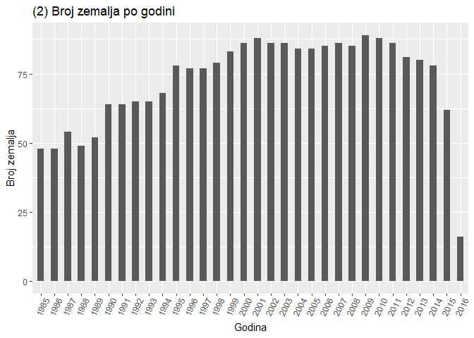<!-- -->

Za 2016. godinu samo 16 zemlja ima neke podatke, ovako mali broj uzoraka
nam nije relevantan.

``` r
data <- data[data$year != 2016, ]
```

``` r
df <- data.frame(data$country, data$year)
df <- unique(df)
countriesTable <- table(df$data.country)
df <- as.data.frame(countriesTable)

cop <- ggplot(df)
cop + geom_bar(aes(Var1, Freq), stat="identity", width = 0.8) + 
      labs(title="(3) Ukupan broj godina sa podacima po zemljama") +
      xlab("Zemlja") + ylab("Ukupan broj godina") +
      theme(axis.text.x = element_text(angle=90, vjust=0.6, size = 5))
```

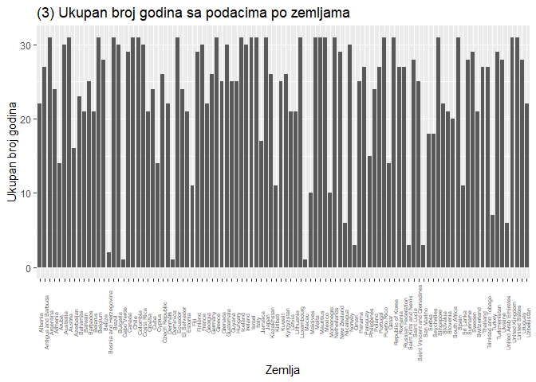<!-- -->

Za sedam zemalja imamo jako malo podataka tako da ih nećemo uzimati u
obzir.

``` r
countries <- df[df$Freq < 4, ]
countires <- as.vector(countries$Var1)

for (c in countires) {
   data <- data[data$country != c, ]
}
```

Zanimljiva analiza bi mogla da bude stopa samoubistva na kontinentima,
tako da ćemo dodati atribut *continent* koristeći *countrycode*
biblioteku.

``` r
data$continent <- countrycode::countrycode(sourcevar = data$country,
                                 origin = "country.name", destination = "continent")
```

Kako se počeci i krajevi raličitih grupa generacija (Boomers,
Millenials…) preklapaju, i ovaj atribut ćemo izbaciti iz dalje
analize.

``` r
data <- subset(data, select = -c(generation))
```

Treba prilagoditi i tipove preostalih atributa.

``` r
data$age <- gsub(" years", "", data$age)
data$gdp_for_year <- gsub(",", "", data$gdp_for_year)
data$sex <- ifelse(data$sex == "male", "Male", "Female")

# faktori sa nazivom
nominal <- c('country', 'sex', 'continent')
data[nominal] <- lapply(data[nominal], function(x){factor(x)})

# brojčani faktori
data$age <- factor(data$age,
                   ordered = T,
                   levels = c("5-14", "15-24", "25-34", "35-54", "55-74", "75+"))

# pretvaranje tipa atributa u double
doubles = c('gdp_for_year', 'gdp_per_capita')
data[doubles] <- lapply(data[doubles], function(x){as.double(x)})

data <- as_tibble(data)

glimpse(data)
```

    ## Rows: 27,492
    ## Columns: 10
    ## $ country           <fct> Albania, Albania, Albania, Albania, Albania, Alba...
    ## $ year              <int> 1987, 1987, 1987, 1987, 1987, 1987, 1987, 1987, 1...
    ## $ sex               <fct> Male, Male, Female, Male, Male, Female, Female, F...
    ## $ age               <ord> 15-24, 35-54, 15-24, 75+, 25-34, 75+, 35-54, 25-3...
    ## $ suicides_no       <int> 21, 16, 14, 1, 9, 1, 6, 4, 1, 0, 0, 0, 2, 17, 1, ...
    ## $ population        <int> 312900, 308000, 289700, 21800, 274300, 35600, 278...
    ## $ suicides.100k.pop <dbl> 6.71, 5.19, 4.83, 4.59, 3.28, 2.81, 2.15, 1.56, 0...
    ## $ gdp_for_year      <dbl> 2156624900, 2156624900, 2156624900, 2156624900, 2...
    ## $ gdp_per_capita    <dbl> 796, 796, 796, 796, 796, 796, 796, 796, 796, 796,...
    ## $ continent         <fct> Europe, Europe, Europe, Europe, Europe, Europe, E...

Set podataka je sada spreman za analizu.

# Analiza

## Globalni trend

### Po godini

``` r
global_average <- (sum(as.numeric(data$suicides_no)) 
                   / sum(as.numeric(data$population))) * 100000
presek = data %>%
  group_by(year) %>%
  summarize(population = sum(population), 
            suicides = sum(suicides_no), 
            suicides_per_100k = (suicides / population) * 100000)
```

    ## `summarise()` ungrouping output (override with `.groups` argument)

``` r
presek %>%
  ggplot(aes(x = year, y = suicides_per_100k)) + 
  geom_line(col = "#6200ee", size = 1) + 
  geom_point(col = "#6200ee", size = 2) + 
  geom_hline(yintercept = global_average, linetype = 2, color = "grey35", size = 1) +
  labs(title = "(4) Globalni trend samoubistva kroz vreme (na 100k stanovnika)",
       subtitle = "1985-2015.",
       x = "Godina", 
       y = "Stopa samoubistva na 100 hiljada stanovnika") + 
  scale_x_continuous(breaks = seq(1985, 2015, 2)) + 
  scale_y_continuous(breaks = seq(10, 20))
```

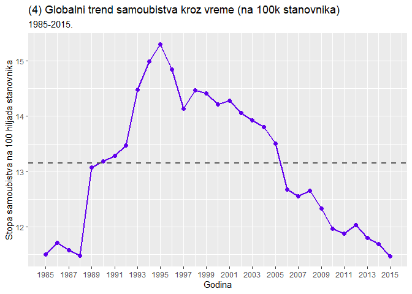<!-- -->

``` r
tail(presek)
```

    ## # A tibble: 6 x 4
    ##    year population suicides suicides_per_100k
    ##   <int>      <int>    <int>             <dbl>
    ## 1  2010 1994548889   238689              12.0
    ## 2  2011 1989236841   236437              11.9
    ## 3  2012 1912812088   230160              12.0
    ## 4  2013 1890161710   223199              11.8
    ## 5  2014 1904772042   222664              11.7
    ## 6  2015 1774657932   203640              11.5

Siva horizontalna linija predstavlja globalnu aritmetičku sredinu.

Analiza:

  - Najveća stopa samoubistva je zabeležena 1995. godine;

  - Primetimo da stopa postepeno opada od 1995. da bi 20 godina kasnije
    ona iznosila \~11.5, što je pad za \~25%;

  - Sa grafika 2 vidimo da podataka iz osamdesetih ima manje nego
    podataka za kasnije godine, tako da reprezentaciju stope za te
    godine uzimamo sa rezervom.

### Po kontinentu

``` r
continent <- data %>%
  group_by(continent) %>%
  summarize(suicide_per_100k = (sum(as.numeric(suicides_no)) 
                                / sum(as.numeric(population))) * 100000) %>%
  arrange(suicide_per_100k)
```

    ## `summarise()` ungrouping output (override with `.groups` argument)

``` r
continent_plot <- ggplot(continent, aes(x = continent, 
                                        y = suicide_per_100k, fill = continent)) + 
  geom_bar(stat = "identity") + 
  labs(title = "(6) Globalni trend samoubistva\n po kontinentu (na 100k stanovnika)",
  x = "Kontinent", 
  y = "Stopa samoubistva na 100k stanovnika", 
  fill = "Continent") +
  theme(legend.position = "none", title = element_text(size = 10)) +
  scale_y_continuous(breaks = seq(0, 20, 1), minor_breaks = F)

continent_time <- data %>%
  group_by(year, continent) %>%
  summarize(suicide_per_100k = (sum(as.numeric(suicides_no)) 
                                / sum(as.numeric(population))) * 100000)
```

    ## `summarise()` regrouping output by 'year' (override with `.groups` argument)

``` r
continent_time$continent <- factor(continent_time$continent, ordered = T, 
                                   levels = continent$continent)

continent_time_plot <- ggplot(continent_time, 
                              aes(x = year, y = suicide_per_100k, 
                                  col = factor(continent))) + 
  facet_grid(continent ~ ., scales = "free_y") + 
  geom_line() + 
  geom_point() + 
  labs(title = "(7) Stopa samoubistva po kontinentu \n kroz vreme", 
       x = "Godina", 
       y = "Stopa samoubistva na 100k stanovnika", 
       color = "Continent") + 
  theme(legend.position = "none", title = element_text(size = 10)) + 
  scale_x_continuous(breaks = seq(1985, 2015, 5), minor_breaks = F)

grid.arrange(continent_plot, continent_time_plot, ncol = 2)
```

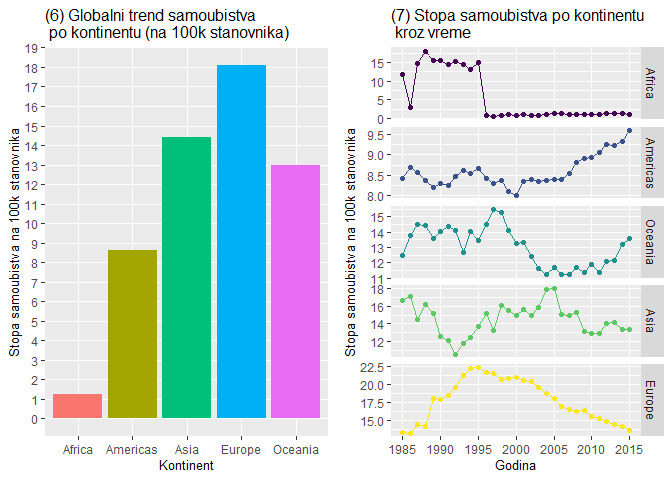<!-- -->

``` r
tail(continent_time)
```

    ## # A tibble: 6 x 3
    ## # Groups:   year [2]
    ##    year continent suicide_per_100k
    ##   <int> <ord>                <dbl>
    ## 1  2014 Oceania              13.2 
    ## 2  2015 Africa                1.17
    ## 3  2015 Americas              9.61
    ## 4  2015 Asia                 13.4 
    ## 5  2015 Europe               13.5 
    ## 6  2015 Oceania              13.6

Analiza:

  - Sa grafika koji pokazuje stopu samoubistva za Afriku čitamo da
    nemamo dovoljno podataka za zemlje sa tog kontinenta (samo tri
    zemlje su podelile podatke);

<!-- end list -->

``` r
length(unique(data$country[data$continent == "Africa"]))
```

    ## [1] 3

  - Evropa ima najveću stopu samoubistva ali se ona postepeno smanjivala
    od 1995. godine kada je dostigla svoj maksimum (kao i stopa na
    globalnom nivou). Do 2015. godine doživela je pad od \~40%;

  - Evropa, Azija i Okeanija imaju sličnu stopu za 2015. godinu;

  - Okeanija i Amerika beleže rast samoubistava, koji je u Americi
    izrašeniji i beleži konstantan rast s početka milenijuma.

### Po zemlji

``` r
country <- data %>%
  group_by(country, continent) %>%
  summarize(n = n(), 
            suicide_per_100k = (sum(as.numeric(suicides_no)) 
                                / sum(as.numeric(population))) * 100000) %>%
  arrange(desc(suicide_per_100k))
```

    ## `summarise()` regrouping output by 'country' (override with `.groups` argument)

``` r
country$country <- factor(country$country, 
                          ordered = T, 
                          levels = rev(country$country))

ggplot(country, aes(x = country, y = suicide_per_100k, fill = continent)) + 
  geom_bar(stat = "identity", width = 0.8) + 
  geom_hline(yintercept = global_average, linetype = 2, color = "grey35", size = 1) +
  labs(title = "(8) Stopa samoubistva po zemljama",
       x = "Zemlja", 
       y = "Stopa samoubistva na 100k stanovnika", 
       fill = "Continent") +
  scale_y_continuous(breaks = seq(0, 45, 2)) + 
  theme(legend.position = "bottom", 
        axis.text.x = element_text(angle=90, vjust=0.6, size = 5))
```

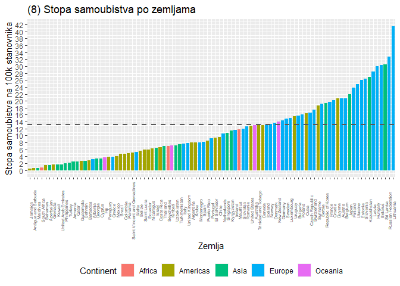<!-- -->

``` r
country <- data %>%
  group_by(country) %>%
  summarize(suicide_per_100k = (sum(as.numeric(suicides_no)) / sum(as.numeric(population))) * 100000)
```

    ## `summarise()` ungrouping output (override with `.groups` argument)

``` r
countrydata <- joinCountryData2Map(country, joinCode = "NAME", nameJoinColumn = "country")
```

    ## 92 codes from your data successfully matched countries in the map
    ## 1 codes from your data failed to match with a country code in the map
    ## 151 codes from the map weren't represented in your data

``` r
par(mar=c(0, 0, 0, 0)) # margins

mapCountryData(countrydata, 
nameColumnToPlot="suicide_per_100k", 
mapTitle="", 
colourPalette = "heat", 
oceanCol="lightblue", 
missingCountryCol="grey65", 
catMethod = "pretty")
```

    ## You asked for 7 categories, 9 were used due to pretty() classification

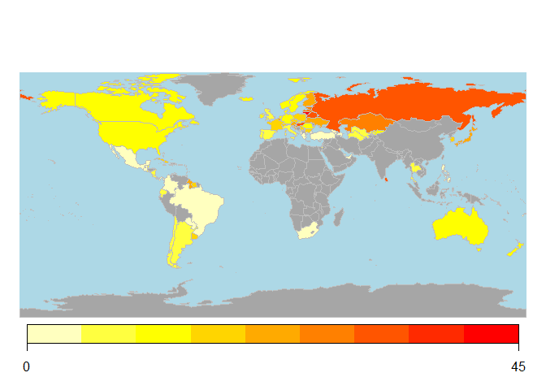<!-- --> Siva
horizontalna linija na grafiku 8 predstavlja globalnu aritmetičku
sredinu.

Analiza:

  - Litvanija ima najveću stopu samoubistva sa više od 41-og samoubistva
    na 100 hiljada stanovnika;

  - Sa povećanjem stope samoubistva, u grafiku, dominira plava boja koja
    predstavlja zemlje Evrope;

  - Sa mape vidimo trend da je stopa samoubistva veća u severnim i
    istočnim zemljama.

<!-- end list -->

``` r
country_year <- data %>%
  group_by(country, year) %>%
  summarize(suicides = sum(suicides_no), 
            population = sum(population), 
            suicide_per_100k = (suicides / population) * 100000, 
            gdp_per_capita = mean(gdp_per_capita))
```

    ## `summarise()` regrouping output by 'country' (override with `.groups` argument)

``` r
country_year_trends <- country_year %>%
  ungroup() %>%
  nest(-country) %>% # zemlja u jednoj koloni, ostalo u drugoj
  mutate(model = map(data, ~ lm(suicide_per_100k ~ year, data = .)),
         tidied = map(model, tidy)) %>% # za svaki element pravi linearni model
  unnest(tidied)
```

    ## Warning: All elements of `...` must be named.
    ## Did you want `data = c(year, suicides, population, suicide_per_100k, gdp_per_capita)`?

``` r
# zemlje čija se stopa linearno menja
country_year_sig_trends <- country_year_trends %>%
  filter(term == "year") %>%
  mutate(p.adjusted = p.adjust(p.value, method = "holm")) %>%
  filter(p.adjusted < .05) %>%
  arrange(estimate)

country_year_sig_trends$country <- factor(country_year_sig_trends$country, 
                                          ordered = T, 
                                          levels = country_year_sig_trends$country)


ggplot(country_year_sig_trends, aes(x=country, y=estimate, col = estimate)) + 
  geom_point(stat='identity', size = 2) +
  geom_hline(yintercept = 0, col = "grey", size = 1) +
  scale_color_gradient(low = "green", high = "red") +
  geom_segment(aes(y = 0, 
                   x = country, 
                   yend = estimate, 
                   xend = country), size = 1) +
  labs(title="(9) Godišnja promena stope samoubistva na 100k stanovnika",  
       x = "Zemlja", y = "Godišnja promena") +
  scale_y_continuous(breaks = seq(-2, 2, 0.2), limits = c(-1.5, 1.5)) +
  theme(legend.position = "none", axis.text.x = element_text(angle=90, vjust=0.6, size = 5))
```

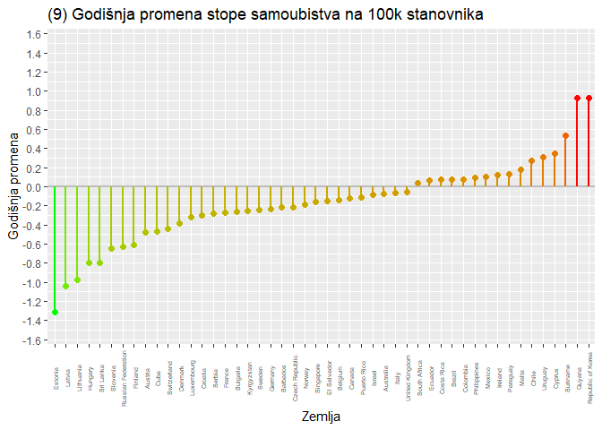<!-- -->

Analiza:

  - \~50% zemlja ima linearnu promenu stope samoubistva;

  - 32 (66%) zemlje beleže pad stope.

<!-- end list -->

``` r
top12_increasing <- tail(country_year_sig_trends$country, 12)

country_year %>%
  filter(country %in% top12_increasing) %>%
  ggplot(aes(x = year, y = suicide_per_100k, col = country)) + 
  geom_point() + 
  geom_smooth(method = "lm") + 
  facet_wrap(~ country) + 
  theme(legend.position = "none") + 
  labs(title="(10) Najbrži rast stope samoubistva",  
       x = "Godina", 
       y = "Stopa samoubistva na 100k stanovnika")
```

    ## `geom_smooth()` using formula 'y ~ x'

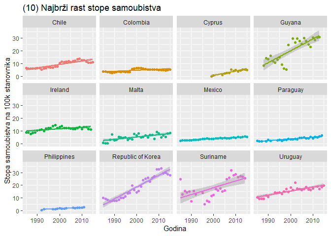<!-- --> Prava na
grafiku predstavlja regresionu pravu. Linearna regresija na grafiku
pokazuje pretpostavljeno kretanje stope samoubistva.

Analiza:

  - Južna Koreja i Gvajana beleže zabrinjavajuće podatke;

  - Krajem devedesetih i početkom dvehiljaditih Gvajana beleži skok
    stope od \~350%.

<!-- end list -->

``` r
top12_decreasing <- head(country_year_sig_trends$country, 12)

country_year %>%
  filter(country %in% top12_decreasing) %>%
  ggplot(aes(x = year, y = suicide_per_100k, col = country)) + 
  geom_point() + 
  geom_smooth(method = "lm") + 
  facet_wrap(~ country) + 
  theme(legend.position = "none") + 
  labs(title="(11) Najbrži pad stope samoubistva",  
       x = "Godina", 
       y = "Stopa samoubistva na 100k stanovnika")
```

    ## `geom_smooth()` using formula 'y ~ x'

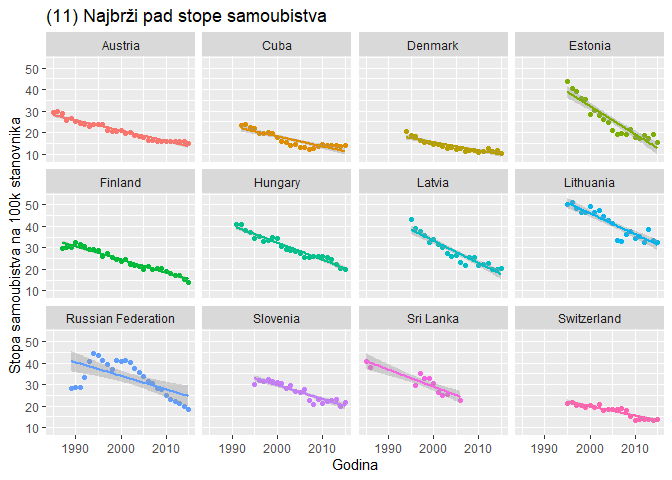<!-- -->

Analiza:

  - Estonija beleži najpozitivnije smanjenje stope od \~64%;
  - U Rusiji pad u stopi se dešava tek nakon 2002. godine.

### Po uzrastu

``` r
age_plot <- data %>%
  group_by(age) %>%
  summarize(suicide_per_100k = (sum(as.numeric(suicides_no)) 
                                / sum(as.numeric(population))) * 100000) %>%
  ggplot(aes(x = age, y = suicide_per_100k, fill = age)) + 
  geom_bar(stat = "identity") + 
  labs(title = "(12) Stopa samoubistva po uzrastu",
       x = "Uzrast", 
       y = "Stopa samoubistva na 100k stanovnika") +
  theme(legend.position = "none") + 
  scale_y_continuous(breaks = seq(0, 30, 1), minor_breaks = F)
```

    ## `summarise()` ungrouping output (override with `.groups` argument)

``` r
age_time_plot <- data %>%
  group_by(year, age) %>%
  summarize(suicide_per_100k = (sum(as.numeric(suicides_no)) 
                                / sum(as.numeric(population))) * 100000) %>%
  ggplot(aes(x = year, y = suicide_per_100k, col = age)) + 
  facet_grid(age ~ ., scales = "free_y") + 
  geom_line() + 
  geom_point() + 
  labs(title = "(13) Stopa samoubistva kroz vreme", 
       x = "Godina", 
       y = "Stopa samoubistva na 100k stanovnika", 
       color = "Age") + 
  theme(legend.position = "none") + 
  scale_x_continuous(breaks = seq(1985, 2015, 5), minor_breaks = F)
```

    ## `summarise()` regrouping output by 'year' (override with `.groups` argument)

``` r
grid.arrange(age_plot, age_time_plot, ncol = 2)
```

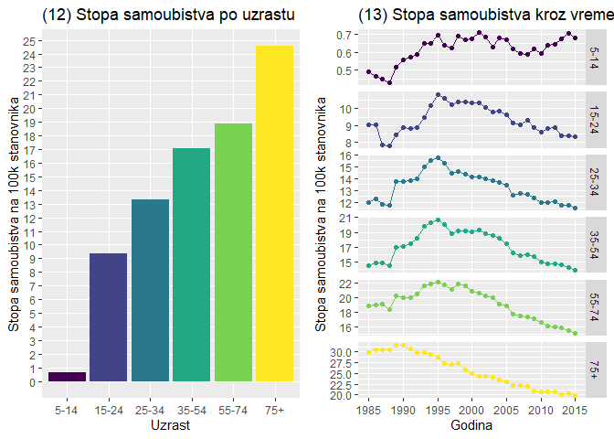<!-- -->

Analiza:

  - Osobe starije od 75 godina su sklonije samoubistvu;

  - Broj samoubistava osoba starijih od 15 godina se postepeno smanjuje
    od 1995. godine, što odgovara globalnom trendu;

  - Broj samoubistava osoba starijih od 75 godina je bio najviši 1990.
    godine, da bi do 2015. godine opao za \~50%;

  - Broj samoubistava osoba uzrasta od 5-14 godina se vrlo malo menjao
    od 1985. od 2015. godine.

### Po uzrastu i kontinentu

``` r
data %>%
  group_by(continent, age) %>%
  summarize(n = n(), 
            suicides = sum(as.numeric(suicides_no)), 
            population = sum(as.numeric(population)), 
            suicide_per_100k = (suicides / population) * 100000) %>%
  ggplot(aes(x = continent, y = suicide_per_100k, fill = age)) + 
  geom_bar(stat = "identity", position = "dodge") + 
  geom_hline(yintercept = global_average, linetype = 2, color = "grey35", size = 1) +
  labs(title = "(14) Stopa samoubistva po uzrastu i kontinentu",
       x = "Kontinent", 
       y = "Stopa samoubistva na 100k stanovnika", 
       fill = "Age")
```

    ## `summarise()` regrouping output by 'continent' (override with `.groups` argument)

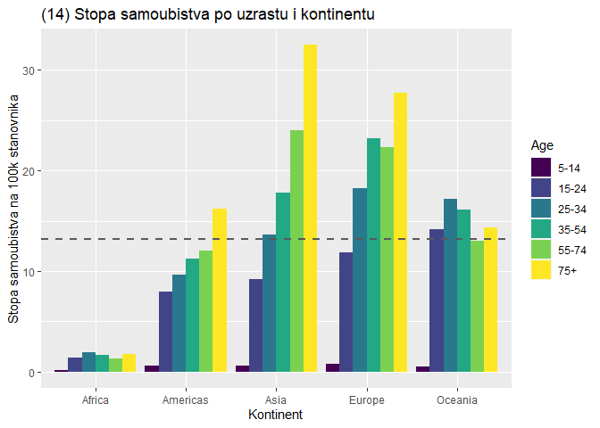<!-- -->

Analiza:

  - Za Ameriku, Aziju i Evropu stopa samoubistva se povećava sa
    starošču;

  - Afrika i Okeanija imaju izjednačenije raspoređene stope po
    uzrastima. Najviša je u uzrastu od 25 do 34 godine;

  - Zaključili smo da imamo malo podataka za Afričke zemlje tako da
    informacije koje izvučemo iz njih treba uzeri sa rezervom.

### Po polu

``` r
sex_plot <- data %>%
  group_by(sex) %>%
  summarize(suicide_per_100k = (sum(as.numeric(suicides_no)) 
                                / sum(as.numeric(population))) * 100000) %>%
ggplot(aes(x = sex, y = suicide_per_100k, fill = sex)) + 
  geom_bar(stat = "identity") + 
  labs(title = "(15) Stopa samoubistva po polu",
       x = "Pol", 
       y = "Stopa samoubistva na 100k stanovnika") +
  theme(legend.position = "none") + 
  scale_y_continuous(breaks = seq(0, 25), minor_breaks = F)
```

    ## `summarise()` ungrouping output (override with `.groups` argument)

``` r
### with time
sex_time_plot <- data %>%
  group_by(year, sex) %>%
  summarize(suicide_per_100k = (sum(as.numeric(suicides_no)) 
                                / sum(as.numeric(population))) * 100000) %>%
  ggplot(aes(x = year, y = suicide_per_100k, col = factor(sex))) + 
  facet_grid(sex ~ ., scales = "free_y") + 
  geom_line() + 
  geom_point() + 
  labs(title = "(16) Stopa samoubistva kroz vreme", 
       x = "Godina", 
       y = "Stopa samoubistva na 100k stanovnika", 
       color = "Sex") + 
  theme(legend.position = "none") + 
  scale_x_continuous(breaks = seq(1985, 2015, 5), minor_breaks = F)
```

    ## `summarise()` regrouping output by 'year' (override with `.groups` argument)

``` r
grid.arrange(sex_plot, sex_time_plot, ncol = 2)
```

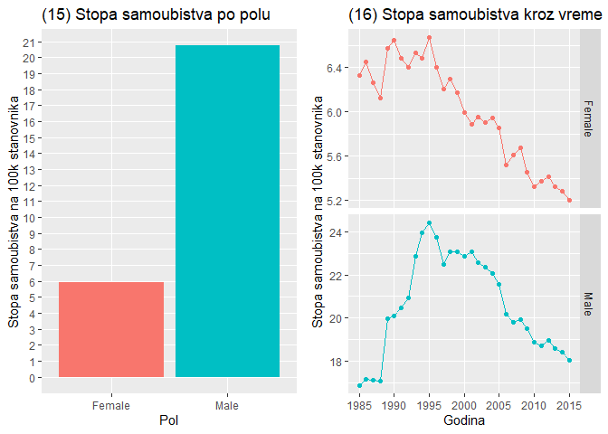<!-- -->

Analiza:

  - Stopa samoubistva je \~3.5x veća kod osoba muškog pola;

  - Stopa samoubistva i osoba muškog i ženskog pola bila je najviša
    1995. godine i od tada opada;

  - Odnos samoubisava muškaraca i žena je tokom godina ostao sličan, oko
    3.5:1 na strani muškaraca.

### Po polu i kontinentu

``` r
data %>%
  group_by(continent, sex) %>%
  summarize(n = n(), 
            suicides = sum(as.numeric(suicides_no)), 
            population = sum(as.numeric(population)), 
            suicide_per_100k = (suicides / population) * 100000) %>%
  ggplot(aes(x = continent, y = suicide_per_100k, fill = sex)) + 
  geom_bar(stat = "identity", position = "dodge") + 
  geom_hline(yintercept = global_average, linetype = 2, color = "grey35", size = 1) +
  labs(title = "(17) Polna raspodela stope samoubistva po kontinentu",
   x = "Kontinent", 
   y = "Stopa samoubistva na 100k stanovnika", 
   fill = "Sex") +
  coord_flip()
```

    ## `summarise()` regrouping output by 'continent' (override with `.groups` argument)

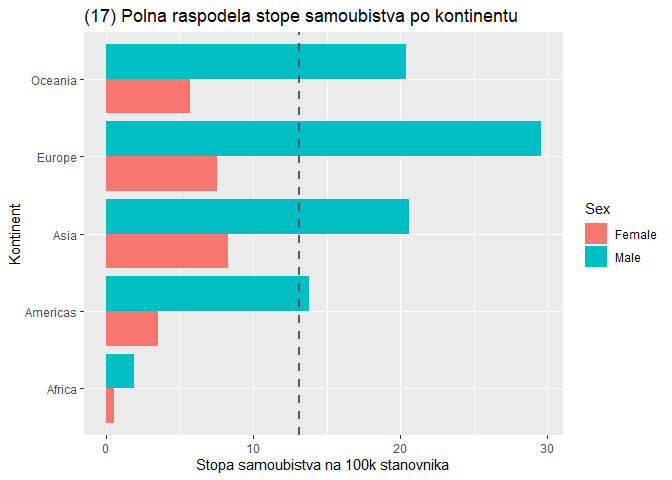<!-- -->

Analiza:

  - Stopa samoubistva osoba muškog pola dominira;

  - Stopa samoubistava muškaraca Evrope je približno \~30 na 100 hiljada
    stanovnika, što je \~4x više u odnosu na žene;

  - Razmera stope muškaraca i žena je najmanja u Aziji.

### Po polu i zemlji

``` r
country_long <- data %>%
  group_by(country, continent) %>%
  summarize(suicide_per_100k = (sum(as.numeric(suicides_no)) / 
                                  sum(as.numeric(population))) * 100000) %>%
  mutate(sex = "OVERALL")
```

    ## `summarise()` regrouping output by 'country' (override with `.groups` argument)

``` r
sex_country_long <- data %>%
  group_by(country, continent, sex) %>%
  summarize(suicide_per_100k = (sum(as.numeric(suicides_no)) / 
                                  sum(as.numeric(population))) * 100000)
```

    ## `summarise()` regrouping output by 'country', 'continent' (override with `.groups` argument)

``` r
sex_country_wide <- sex_country_long %>%
  spread(sex, suicide_per_100k) %>%
  arrange(Male - Female)


sex_country_wide$country <- factor(sex_country_wide$country, 
                                         ordered = T, 
                                         levels = sex_country_wide$country)

country_gender_prop <- sex_country_wide %>%
  mutate(Male_Proportion = Male / (Female + Male)) %>%
  arrange(Male_Proportion)

sex_country_long$country <- factor(sex_country_long$country, 
                                   ordered = T,
                                   levels = country_gender_prop$country)

ggplot(sex_country_long, aes(y = suicide_per_100k, x = country, fill = sex)) + 
  geom_bar(position = "fill", stat = "identity", width = 0.5) +
  scale_y_continuous(labels = scales::percent) +
  labs(title = "(18) Odnos stope samoubistva muškaraca i žena po zemlji", 
       x = "Zemlja", 
       y = "",
       fill = "Sex") +
  theme(axis.text.x = element_text(angle=90, vjust=0.6, size = 5))
```

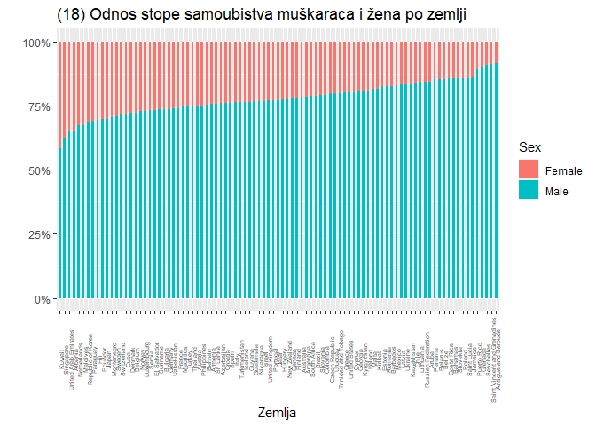<!-- -->

Analiza:

  - Uviđamo globalni trend u samoubistvima gde dominiraju osobe muškog
    pola;

  - Češće je da žene boluju od depresije i imaju suicidne misli, ali je
    verovatnije da muškarac izvrši samoubistvo. Ovo se naziva “Polni
    paradoks o suicidnom ponašanju”.

### Po prihodu po glavi stanovnika

Kako se stopa samoubistva menja sa povećanjem prihoda stanovnika jedne
zemlje?

Izračunaćemo Pirsonov koeficijent korelacije za prihod po glavi
stanovnika i kalendarsku godinu.

``` r
country_year_gdp <- data %>%
  group_by(country, year) %>%
  summarize(gdp_per_capita = mean(gdp_per_capita))
```

    ## `summarise()` regrouping output by 'country' (override with `.groups` argument)

``` r
country_year_gdp_corr <- country_year_gdp %>%
  ungroup() %>%
  group_by(country) %>%
  summarize(year_gdp_correlation = cor(year, gdp_per_capita))
```

    ## `summarise()` ungrouping output (override with `.groups` argument)

``` r
mean(country_year_gdp_corr$year_gdp_correlation)
```

    ## [1] 0.8780947

Prosečni Pirsonov koeficijent korelacije je 0.87, iz čega sledi da je
korelacija ova dva atributa izuzetno jaka. Ovo ćemo podrazumevati za sve
zemlje.

Izračunaćemo za ceo vremenski interval prosečna primanja po glavi
stanovnika za svaku zemlju i prikazati ih u odnosu na stopu samoubistva
te zemlje tokom celog vremenskog intervala.

``` r
country_mean_gdp <- data %>%
  group_by(country, continent) %>%
  summarize(suicide_per_100k = (sum(as.numeric(suicides_no)) 
                                / sum(as.numeric(population))) * 100000, 
            gdp_per_capita = mean(gdp_per_capita))
```

    ## `summarise()` regrouping output by 'country' (override with `.groups` argument)

``` r
ggplot(country_mean_gdp, aes(x = gdp_per_capita, 
                             y = suicide_per_100k, col = continent)) + 
  geom_point() + 
  scale_x_continuous(labels=scales::dollar_format(prefix="$"), 
                     breaks = seq(0, 70000, 10000)) + 
  labs(title = "(19) Korelacija izmedju prihoda po glavi stanovnika i stope samoubistva", 
       subtitle = "Sadrži sve zemlje",
       x = "Prihod po glavi stanovnika", 
       y = "Stopa samoubistva na 100k stanovnika", 
       col = "Continent") 
```

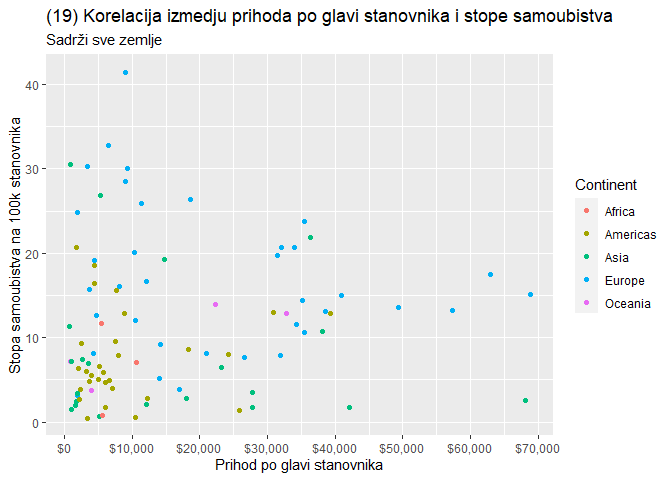<!-- -->

Na grafiku možemo videti da ima ekstremnih vrednosti (tačka u gornjem
levom uglu) koje mogu uticati na regresionu pravu. Izbacićemo takve
vrednosti koristeći Kukovo rastojanje. Kukovo rastojanje je mera uticaja
tačke na regresionu analizu.

``` r
model1 <- lm(suicide_per_100k ~ gdp_per_capita, data = country_mean_gdp)

gdp_suicide_no_outliers <- model1 %>%
  augment() %>%
  arrange(desc(.cooksd)) %>%
  filter(.cooksd < 4/nrow(.)) %>%
  inner_join(country_mean_gdp, by = c("suicide_per_100k", "gdp_per_capita")) %>%
  select(country, continent, gdp_per_capita, suicide_per_100k)

model2 <- lm(suicide_per_100k ~ gdp_per_capita, data = gdp_suicide_no_outliers)

summary(model2)
```

    ## 
    ## Call:
    ## lm(formula = suicide_per_100k ~ gdp_per_capita, data = gdp_suicide_no_outliers)
    ## 
    ## Residuals:
    ##     Min      1Q  Median      3Q     Max 
    ## -11.769  -5.145  -1.724   3.227  20.221 
    ## 
    ## Coefficients:
    ##                 Estimate Std. Error t value Pr(>|t|)    
    ## (Intercept)    8.772e+00  1.119e+00   7.839 1.12e-11 ***
    ## gdp_per_capita 1.115e-04  5.015e-05   2.223   0.0288 *  
    ## ---
    ## Signif. codes:  0 '***' 0.001 '**' 0.01 '*' 0.05 '.' 0.1 ' ' 1
    ## 
    ## Residual standard error: 7.331 on 86 degrees of freedom
    ## Multiple R-squared:  0.05436,    Adjusted R-squared:  0.04337 
    ## F-statistic: 4.944 on 1 and 86 DF,  p-value: 0.02881

``` r
ggplot(gdp_suicide_no_outliers, aes(x = gdp_per_capita, y = suicide_per_100k, 
                                    col = continent)) + 
  geom_point() + 
  geom_smooth(method = "lm", aes(group = 1)) + 
  scale_x_continuous(labels=scales::dollar_format(prefix="$"), 
                     breaks = seq(0, 70000, 10000)) + 
  labs(title = "(20) Korelacija izmedju prihoda po glavi stanovnika i stope samoubistva", 
       subtitle = "Sadrži zemlje koje su zadovoljile Kukovo rastojanje",
       x = "Prihod po glavi stanovnika", 
       y = "Stopa samoubistva na 100k stanovnika", 
       col = "Continent") + 
  theme(legend.position = "none")
```

    ## `geom_smooth()` using formula 'y ~ x'

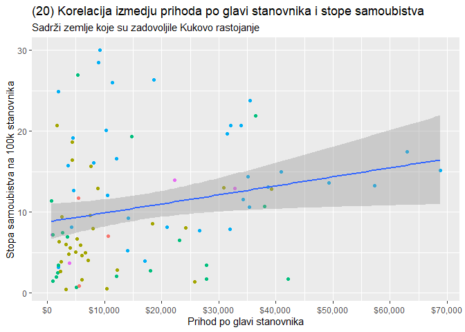<!-- -->

Cilj je bio ispitati da li postoji pravilo po kome se stopa samoubistva
menja sa prosečnim prihodom po glavi stanovnika. P vrednost 0.02881 \<
0.05 iz čega sledi da prihod po glavi stanovnika utiče na stopu
samoubistva. R-squared (govori koliko regresiona prava odgovara
podacima) 0.05436 nam govori da podaci dosta odstupaju od regresione
prave. Ipak, postoji slaba veza (što se može videti na grafiku 20)
između ova dva atributa. Bogatije zemlje imaju veću stopu samoubistva.

Jednačina regresione prave se čita iz *model2* regresionog modela u kodu
iznad i ona glasi: \[ samoubistva = 8.772 + 0.115 * GDP\]

## Srbija i okolina

### Po godini

``` r
data_filtered <- data %>%
  filter(country %in% c("Serbia", 
                        "Croatia",
                        "Hungary", 
                        "Slovenia") & year >= 1995) 

data_filtered %>%
  group_by(country, year) %>%
  summarize(suicide_per_100k = (sum(as.numeric(suicides_no)) 
                                / sum(as.numeric(population))) * 100000) %>%
  ggplot(aes(x = year, y = suicide_per_100k, col = country)) + 
  geom_point(alpha = 0.5) + 
  geom_smooth(se = F, span = 0.2) + 
  scale_x_continuous(breaks = seq(1995, 2015, 5), minor_breaks = F) + 
  labs(title = "(21) Srbija, Hrvatska, Mađarska i Slovenija", 
       subtitle = "Stopa samoubistva na 100k stanovnika, 1995 - 2015", 
       x = "Godina", 
       y = "Stopa samoubistva na 100k stanovnika", 
       col = "Country")
```

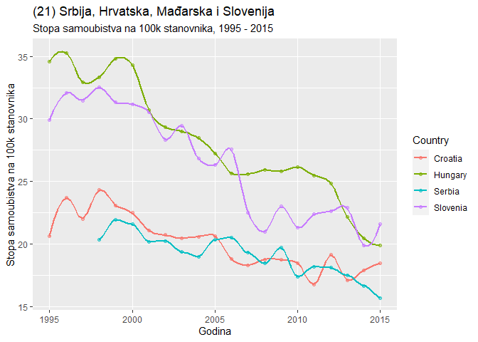<!-- -->

Analiza:

  - Sve zemlje prate globalni trend pada stope samoubistva;

  - Stopa samoubistva Mađarske se smanjila 40% od 1995. godine;

  - Stopa samoubistva Slovenija je imala veliki pad izmedju 2006. i
    2007. godine.

### Po polu

``` r
data_filtered %>%
  group_by(country, sex, year) %>%
  summarize(suicide_per_100k = (sum(as.numeric(suicides_no))
                                / sum(as.numeric(population))) * 100000) %>%
  ggplot(aes(x = year, y = suicide_per_100k, col = country)) + 
  geom_point(alpha = 0.5) + 
  geom_smooth(se = F, span = 0.2) + 
  scale_x_continuous(breaks = seq(1985, 2015, 5), minor_breaks = F) + 
  facet_wrap(~ sex, scales = "free_y", nrow = 2) +
  labs(title = "(22) Srbija, Hrvatska, Mađarska i Slovenija", 
       subtitle = "Stopa samoubistva po polu, 1995 - 2015", 
       x = "Godina", 
       y = "Stopa samoubistva na 100k stanovnika", 
       col = "Country")
```

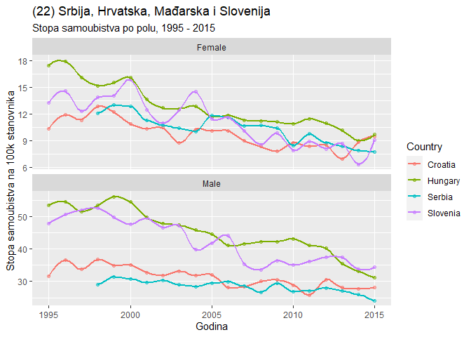<!-- -->

Analiza:

  - Odnos stope samoubistva osoba muškog i ženskog pola, prati globalni
    trend. \~3x više muškaraca izvrši samoubistvo;

  - U Sloveniji, 2004. godine je došlo do skoka samoubistava žena a pada
    samoubistava muškaraca.

### Po uzrastu

``` r
data_filtered %>%
  group_by(country, age) %>%
  summarize(suicide_per_100k = (sum(as.numeric(suicides_no)) 
                                / sum(as.numeric(population))) * 100000) %>%
  ggplot(aes(x = country, y = suicide_per_100k, fill = age)) + 
  geom_bar(stat = "identity", position = "dodge") + 
  labs(title = "(23) Srbija, Hrvatska, Mađarska i Slovenija", 
       subtitle = "Stopa samoubistva po uzrastu, 1995 - 2015", 
       x = "Zemlja", 
       y = "Stopa samoubistva na 100k stanovnika", 
       fill = "Age")
```

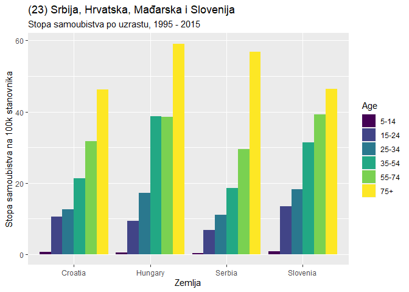<!-- -->

Analiza:

  - Sve zemlje imaju sličan trend;

  - Kao i globalno, starije osobe su sklonije samoubistvu.

# Mašinsko učenje

Primenom mašinskog učenja nad nekim podacima možemo da predvidimo
njihove buduće vrednosti. Najkorinija vrednost i najpogodnija za
predviđanje bila bi stopa samoubistva.

Samoubistvo može biti izazvano bilo čime. Razlog samoubistva je
nepredvidim, može, a i ne mora da ima veze sa bilo kojim od atributa
našeg skupa podataka, a model mašinskog učenja je onoliko dobar koliko
su dobri i pogodni podaci sa kojima radi.

## Kreiranje trening i testnog skupa podataka

``` r
library(class)
library(aod)
library(neuralnet)
library(randomForest)
library(rpart)
library(rpart.plot)

ml_ready <- data %>%
  group_by(country, year, sex) %>%
  summarize(
            sex = ifelse(sex == "Male", 1, 2),
            gdp_for_year = sum(as.numeric(gdp_for_year)),
            gdp_per_capita = mean(gdp_per_capita), 
            population = sum(as.numeric(population)),
            suicide_per_100k = (sum(as.numeric(suicides_no)) 
                                / sum(as.numeric(population))) * 100000)

smp_size <- floor(0.75 * nrow(ml_ready))

set.seed(123)
train_idx <-sample(seq_len(nrow(ml_ready)), size = smp_size)

train <- ml_ready[train_idx, ]
test <- ml_ready[train_idx, ]
test_rev <- test
```

## Linearna regresija

``` r
reg_model <- lm(suicide_per_100k ~  gdp_per_capita  , 
                data = train)

summary(reg_model)
```

    ## 
    ## Call:
    ## lm(formula = suicide_per_100k ~ gdp_per_capita, data = train)
    ## 
    ## Residuals:
    ##     Min      1Q  Median      3Q     Max 
    ## -13.755  -8.499  -4.099   3.968  76.350 
    ## 
    ## Coefficients:
    ##                 Estimate Std. Error t value Pr(>|t|)    
    ## (Intercept)    1.156e+01  1.184e-01  97.643  < 2e-16 ***
    ## gdp_per_capita 2.582e-05  4.674e-06   5.523 3.37e-08 ***
    ## ---
    ## Signif. codes:  0 '***' 0.001 '**' 0.01 '*' 0.05 '.' 0.1 ' ' 1
    ## 
    ## Residual standard error: 12.69 on 20617 degrees of freedom
    ## Multiple R-squared:  0.001477,   Adjusted R-squared:  0.001429 
    ## F-statistic:  30.5 on 1 and 20617 DF,  p-value: 3.371e-08

``` r
ggplot(train, aes(x = gdp_per_capita, y = suicide_per_100k)) +
  geom_point() +
  geom_smooth(method="lm") +
  labs(
       x = "Prihod po glavi stanovnika", 
       y = "Stopa samoubistva na 100k stanovnika") 
```

    ## `geom_smooth()` using formula 'y ~ x'

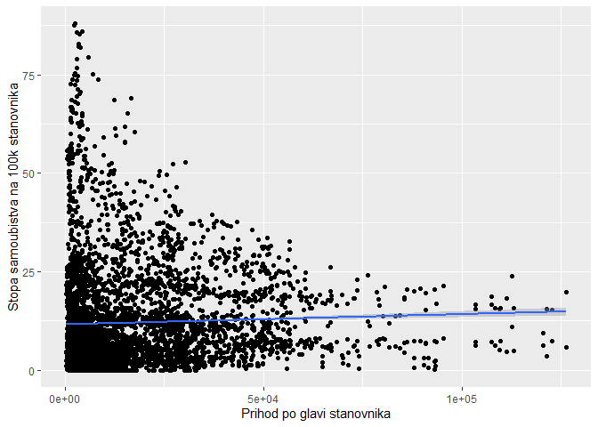<!-- -->

``` r
test_rev$suicide_per_100k_predicted_lr <- predict(reg_model, test)

tail(test_rev[, c(7,8)])
```

    ## # A tibble: 6 x 2
    ##   suicide_per_100k suicide_per_100k_predicted_lr
    ##              <dbl>                         <dbl>
    ## 1             4.34                          11.6
    ## 2            23.1                           11.7
    ## 3            36.9                           11.8
    ## 4             0                             11.7
    ## 5             5.01                          12.4
    ## 6             8.77                          11.6

Iz prethodne analize smo uvideli da su prosečni prihod po glavi
stanovnika i stopa samoubistva jako slabo povezani. Korišćenjem proste
linearne regresije i višestruke linearne regresije još po veličini
populacije ne dobijamo apsolutno ništa. Ako uzmemo da aposlutna vrednost
razlike prave i modelom predviđene vrednosti bude manja od nekog praga
(koji biramo) možemo da izračunamo koliko je “tačnih” stopa model
predvideo. “Tačne” stope nisu stvarno tačne, sa povećanjem praga, rašće
i broj pogodaka, što ne znači da je model dobar.

Zbog prirode podataka i nepredvidivosti samoubistva, linearna regresija
nije dobar model.

Moraćemo da koristimo modele pogodne za modelovanje vremenskih serija.

## Random Forest

``` r
rf <- randomForest(suicide_per_100k ~ 
                     sex + 
                     gdp_per_capita + 
                     population +
                     year, 
                   data = train, type = regression)
test_rev$suicide_per_100k_predicted_rf <- predict(rf, test)

tail(test_rev[, c(7,9)])
```

    ## # A tibble: 6 x 2
    ##   suicide_per_100k suicide_per_100k_predicted_rf
    ##              <dbl>                         <dbl>
    ## 1             4.34                          4.91
    ## 2            23.1                          21.7 
    ## 3            36.9                          22.5 
    ## 4             0                             1.81
    ## 5             5.01                         16.2 
    ## 6             8.77                          6.01

Random Forest algoritam daje nam rezultate koji nisu upotrebljivi.

## Holtovo eksponencijalno glačanje

Za aperiodične vremenske serije sa rastućim ili opadajućim trendom
koristi se Holtovo eksponencijalno glačanje za kratkoročna predviđanja.
Metod procenjuje vrednost i nagib određene tačke u vremenu. Glačanje je
kontrolisano pomoću dva parametra. Alfa - za procenjivanje vrednosti,
Beta - za procenjivanje nagiba. Vrednosti parametara su od 0 do 1 i
označavaju kolika se težina daje skorijim vrednostima.

Procenićemo vrednost stope samoubistva za Srbiju u narednih 8 godina,
počevši od 2015. godine.

``` r
library("forecast")
```

    ## Registered S3 method overwritten by 'quantmod':
    ##   method            from
    ##   as.zoo.data.frame zoo

``` r
data_serbia <- data %>% filter(country == "Serbia") %>%
                group_by(country, year) %>%
                summarize(suicide_per_100k = (sum(as.numeric(suicides_no))
                            / sum(as.numeric(population))) * 100000)
```

    ## `summarise()` regrouping output by 'country' (override with `.groups` argument)

``` r
data_serbia <- data_serbia$suicide_per_100k

data_serbia_ts <- ts(data_serbia, start = c(1998))
plot.ts(data_serbia_ts, main = "(24) Stopa samoubistva u Srbiji", 
        xlab = "Godina", 
        ylab = "Stopa samoubistva na 100k stanovnika")
```

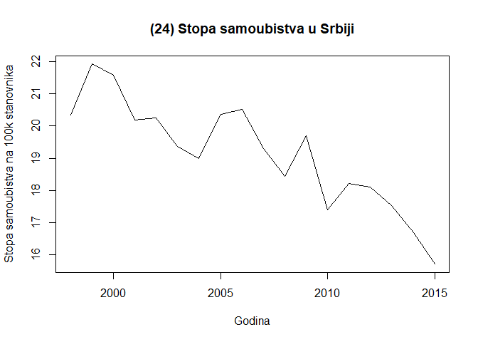<!-- -->

``` r
serbia_suicide_forecast <- HoltWinters(data_serbia_ts, gamma=F, 
                                       l.start = data_serbia[1], 
                                       b.start = data_serbia[2] - data_serbia[1])
serbia_suicide_forecast
```

    ## Holt-Winters exponential smoothing with trend and without seasonal component.
    ## 
    ## Call:
    ## HoltWinters(x = data_serbia_ts, gamma = F, l.start = data_serbia[1],     b.start = data_serbia[2] - data_serbia[1])
    ## 
    ## Smoothing parameters:
    ##  alpha: 0.8212844
    ##  beta : 0.4055597
    ##  gamma: FALSE
    ## 
    ## Coefficients:
    ##         [,1]
    ## a 15.8026531
    ## b -0.6886215

``` r
plot(serbia_suicide_forecast, 
     main = "(25) Poređenje stopa samoubistva u Srbiji sa modelom", 
     xlab = "Godina", 
     ylab = "Stopa samoubistva na 100k stanovnika")
```

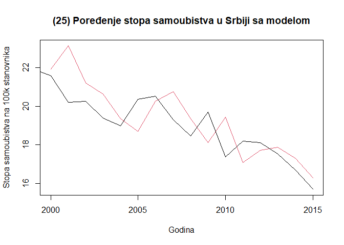<!-- -->

``` r
serbia_suicide_forecast2 <- forecast(serbia_suicide_forecast, h = 8)
serbia_suicide_forecast2
```

    ##      Point Forecast      Lo 80    Hi 80     Lo 95    Hi 95
    ## 2016       15.11403 13.5166078 16.71146 12.670983 17.55708
    ## 2017       14.42541 11.9857109 16.86511 10.694212 18.15661
    ## 2018       13.73679 10.3312223 17.14235  8.528424 18.94515
    ## 2019       13.04817  8.5698628 17.52647  6.199192 19.89714
    ## 2020       12.35955  6.7123951 18.00670  3.722974 20.99612
    ## 2021       11.67092  4.7666226 18.57523  1.111706 22.23014
    ## 2022       10.98230  2.7386011 19.22600 -1.625351 23.58996
    ## 2023       10.29368  0.6332353 19.95413 -4.480696 25.06806

``` r
plot(serbia_suicide_forecast2, 
     main = "Predviđena stopa samoubistva \n za narednih 8 godina (počevši od 2015.)", 
     xlab = "Godina", 
     ylab = "Stopa samoubistva na 100k stanovnika")
```

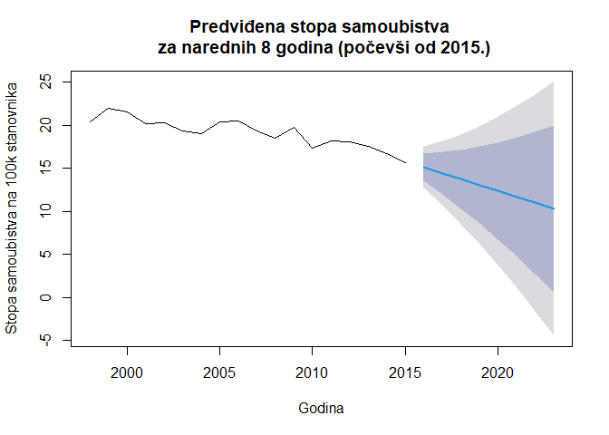<!-- --> Po grafiku
generisanim modelom Holtovog eksponencijalnog glačanja, Srbija prati
globalni trend smanjivanja stopa samoubistva.

# Zaključak

  - Stopa samoubistva se globalno smanjuje. Od zemalja koje pokazuju
    linearnu promenu, 2/3 beleži pad;

  - U Evropi, Aziji i Americi, stopa samoubistva se povećava sa
    starošću, dok Afrika i Okeanija ne beleže takav trend;

  - Postoji slaba veza između prosečnog primanja po glavi stanovnika i
    stope samoubistva;

  - Stopa samoubistva osoba muškog pola je \~3.5x veća od stope osoba
    ženskog pola.

Samoubistvo je nepredvidivo i dešava se iz najrazličitijih okolnosti,
stoga, korišćenjem mašinskog učenja nije moguće predvideti buduće
trendove.

# Literatura

  - <https://en.wikipedia.org/wiki/Cook%27s_distance>

  - <https://en.wikipedia.org/wiki/Gender_differences_in_suicide>

  - <https://www.kaggle.com/lmorgan95/r-suicide-rates-in-depth-stats-insights>

  - <https://blog.minitab.com/blog/adventures-in-statistics-2/regression-analysis-how-do-i-interpret-r-squared-and-assess-the-goodness-of-fit>

  - Uvod u programski jezik R, Miloš Ivanović, Tatjana Bošković

  - <https://www.simplypsychology.org/p-value.html>

  - <https://a-little-book-of-r-for-time-series.readthedocs.io/en/latest/src/timeseries.html#seasonally-adjusting>
